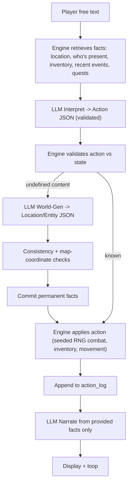

# LLM RPG

An LLM-narrated text RPG that procedurally generates a world around your
decisions. The design goal is a game that *feels real and evolves*: it resists
hallucination and keeps a persistent, consistent memory by treating the LLM as a
narrator only, never as the source of truth.

## The core idea: separate "truth" from "voice"

The single decision that makes this work is that **the LLM never holds game
state**. A deterministic engine over a SQLite database is the single source of
truth. The model is used for exactly three narrow jobs:

1. **Interpret** your free-text input into a structured action.
2. **Generate** new structured content (a location, an NPC, an enemy) the first
   time you reach something undefined.
3. **Narrate** the engine's outcome using *only* the facts it is given.

Every turn the engine retrieves the relevant facts from the database and hands
them to the narrator, which is forbidden from inventing anything new. Generated
content is schema-validated and consistency-checked before it is ever committed,
then frozen as permanent facts that are looked up forever after.



### How this maps to the goals

- **Prevent hallucinations** - narration is grounded in retrieved facts; the
  narrator may not invent entities, names, stats, or exits; all generated content
  is schema-validated (`pydantic`) and reconciled against existing facts.
- **Persistent memory** - the SQLite store *is* the memory. Nothing the model
  "remembers" is trusted; everything is a database lookup.
- **Unique but accurate per run** - each run has a seed (RNG + your world
  prompt). Content is generated once, then permanent and consistent.
- **No fixed prestory constants** - there is no hardcoded lore. Every world fact
  is a row in the `facts` table, queried at runtime.
- **Adjusts to the story you want** - generation is conditioned on your world
  prompt plus existing facts, so enemies, NPCs, and places match the tone.
- **Consistent map** - locations carry integer coordinates. Moving in a
  direction computes destination coordinates; if a location already exists there,
  the engine links to it (and adds the reverse exit) instead of duplicating, so
  the map is always traversable and collision-free.

## Install

Requires Python 3.11+.

From the project root, create a venv (recommended) and install the package in
editable mode. The code lives under `src/`, so this step is required for
`python -m llm_rpg` to find the module:

```bash
python -m venv .venv
.venv\Scripts\activate          # Windows
# source .venv/bin/activate     # macOS / Linux

pip install -r requirements.txt
pip install -e .
```

Optional provider SDKs (only if you use that provider):

```bash
pip install openai      # OpenAI
pip install anthropic   # Anthropic / Claude
pip install httpx       # Ollama (local models)
```

## Play

The default provider is `mock`, which runs fully offline with no API key
(deterministic; great for trying it out):

```bash
python -m llm_rpg
```

Or use the console script installed by `pip install -e .`:

```bash
llm-rpg
```

**Without installing** (quick dev only):

```bash
python run.py
```

### In-game

Type what you want to do in plain language, or use single-key shortcuts:

| Key | Action |
|-----|--------|
| `l` | look around |
| `n` `s` `e` `w` | go north / south / east / west |
| `i` | inventory |
| `m` | show map |
| `h` | help |
| `q` | save and quit |

You can still type full phrases: `take the rusty key`, `talk to the stranger`,
`attack the wolf`, etc.

Menus also use single keys: main menu `[n]` new / `[l]` load / `[q]` quit;
new game `[1]` describe / `[2]` preset / `[3]` surprise (or `d` / `p` / `s`).

Saves are stored as one SQLite file per run in `saves/` and offered on the next
launch.

## Configuration

Copy `config.example.yaml` to `config.yaml` and edit it, or pass
`--config path/to.yaml`. Override the provider on the fly with
`--provider openai|anthropic|ollama|mock`.

| Provider    | Needs                                   | Notes                          |
|-------------|-----------------------------------------|--------------------------------|
| `mock`      | nothing                                 | Offline, deterministic         |
| `openai`    | `OPENAI_API_KEY` (or in config)         | Uses JSON response mode        |
| `anthropic` | `ANTHROPIC_API_KEY` (or in config)      | JSON enforced via prompt+repair|
| `ollama`    | a running Ollama server                 | Local models, set `host`/`model`|

Other settings: `saves_dir`, `memory_window` (how many recent events feed
short-term memory), `json_repair_retries` (retries when the model returns
invalid JSON).

## Project layout

```
src/llm_rpg/
  main.py, cli.py, config.py, rng.py
  llm/      base.py + mock/openai/anthropic/ollama providers, prompts.py
  state/    schema.sql, models.py, db.py, repository.py
  engine/   engine.py, actions.py, world_gen.py, combat.py, consistency.py, memory.py
  game/     session.py, new_game.py
tests/
```

- `state/` is the source of truth (schema + pydantic models + repository).
- `engine/` is the deterministic authority (turn loop, actions, combat, lazy
  world generation, consistency guards, memory retrieval).
- `llm/` is the pluggable, schema-validating model layer.

## Tests

```bash
python -m pytest
```

The suite covers the deterministic engine paths and the anti-hallucination
guards: seeded RNG reproducibility, repository lookups, map collision/linking,
consistency checks, JSON validation/repair, and a full offline turn flow
(seed -> look -> move -> deterministic combat) using the mock provider.

## Extending

- **New action**: add a handler in `engine/actions.py`, register it in
  `HANDLERS`, and add its type to `ActionType` in `state/models.py`.
- **New provider**: implement `LLMProvider.complete` in `llm/` and wire it into
  `build_provider`.
- **Richer world**: the `facts`, `stats`, `relationships`, and `quests` tables
  are generic and ready to back deeper systems.

## Changelog

### 0.2.0

- **Item catalog** — seed LLM defines canonical items with numeric stats; world gen and grants reuse them.
- **Consumables** — `use healing potion` applies `heal_hp` from the catalog and consumes a charge.
- **Dialogue grants** — NPC handoffs materialize into inventory; gold parsed correctly; prose cannot become fake items.
- **Kill rewards** — bounty payouts require the foe to actually be dead in the database.
- **Combat intent** — lines like “finish the golem” or “swing at” route to attack, not NPC chat.
- **Talk routing** — fuzzy NPC names, “turn to X and ask”, and follow-ups go to the right partner; enemies cannot gift loot in dialogue.
- **Items & combat** — one entity row per item name (stack via qty); dead enemies leave the room and can drop catalog loot.

## Not in v1 (designed for later)

- A graphical/web map UI - location coordinates are already stored so it can be
  layered on without regenerating worlds.
- Vector/semantic long-term memory - the structured store plus recent-event
  retrieval covers v1.
